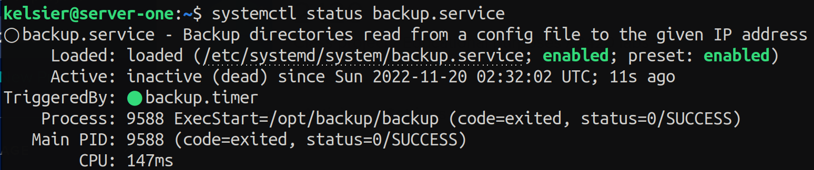
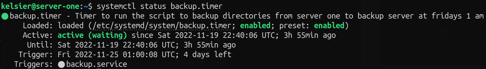

# ACIT 2420 WEEK 11 Lab
## Team Members

- Simon Freeman
- Uday Chhina

## Backup

Creates and updates backups of specified directories from server-one into the backup-server every Friday at 01:00.

1. Create a directory in `/opt` by using `sudo mkdir /opt/<dirname>`. Here we have called it `/opt/backup/`.
#### create the script

> Use `sudo` only when required!

1. Make the backup script that will use `rsync` to backup directories from `server-one` to `backup-server`. 
2. Move this file into `/opt/backup` and ensure it has execute permissions (`chmod +x backup`).

```bash
#!/bin/bash
. /opt/backup/backup_config
rsync -aPq "${DIRS[@]}" "dalinar@${IP}:~/" -e "ssh -i /home/kelsier/.ssh/backup_key -o StrictHostKeyChecking=no"
```
#### create the config file
The config file will be placed in the `/opt/backup/` directory as well. It will have two variables:

- `DIRS`: An array of directories to back up. Must use absolute paths.
- `IP`: The IP address of backup-server.  

```
DIRS=("/home/kelsier/test1" "/home/kelsier/test2" "/home/kelsier/test3")
IP=146.190.41.39
```

- **SSH key** should match the SSH key of **your own backup server**. This is to be specified in the script, inside the section with double quotes. 
- **The user and host** should also be specified inside the `rsync` command: 
    

#### backup_config

1. Create file inside the /opt/backup directory
2. Specify the directories to backup and the ip of backup-server
    - IP should match the **IP of your own backup server**, and directories should match the path of **directories you wish to backup**


### backup.service

1. Place the file in /etc/systemd/system    
2. To enable the service, use `systemctl enable backup-service.service` 
3. To start  the service, use `systemctl start backup-service.service`
4. Verify the service is active with `systemctl status backup-service.service`

If successful, systemctl status should look like screenshot below:


### backup.timer
1. Place the file in /etc/systemd/system    
2. To enable the service, use `systemctl enable backup-timer.timer` 
3. To start  the service, use `systemctl start backup-timer.timer`
4. Verify the service is active with `systemctl status backup-timer.timer`


If successful, systemctl status should look like screenshot below:



## Weather Script

Retrieves the weather forecast in Vancouver every day at 05:00

### weather
Place the script in /opt/weather

### weather.service
1. Place the file in /etc/systemd/system    
2. To enable the service, use `systemctl enable weather.service` 
3. To start  the service, use `systemctl start weather.service`
4. Verify the service is active with `systemctl status weather.service`
- if successful, systemctl status should look like screenshot below:

### weather.timer
1. Place the file in /etc/systemd/system    
2. To enable the service, use `systemctl enable weather.timer` 
3. To start  the service, use `systemctl start weather.timer`
4. Verify the service is active with `systemctl status weather.timer`
- if successful, systemctl status should look like screenshot below:
